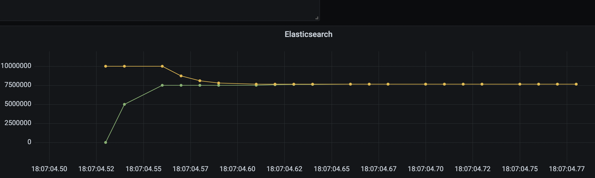

## 7. 観測値のエクスポート

JISDは観測値をリアルタイムでエクスポートする機能を有しています．現在エクスポート先としてサポートしているのは以下のツールです．

- Elasticsearch
- Prometheus

JISDのエクスポート先は**Elasticsearch**をおすすめします．なぜなら，観測値の更新頻度が高い場合，Prometheusでは値の取りこぼしが発生しやすいためです．Elasticsearchをエクスポート先に設定した場合，観測値の更新頻度が高くても，JISDが観測値をキャッシュしてから一定間隔でデータを送信するので値を取りこぼすことはありません．

ユーザは上記ツールからGrafanaやKibanaで，観測値を可視化することができます．このとき，各可視化ツールの表示間隔に注意してください．値観測の間隔があまりにも短い(一般に，10msより短い)とき，可視化ツールでうまく表示できない場合があります．JISDはあまりにも短い間隔での値観測を検出した場合警告を発しますが，値観測は通常通り行われます．
 
以下の各セクションでは，ElasticsearchとGrafanaを用いた観測値の可視化方法について説明します． 

以下ではElasticsearch環境とGrafana環境が必要となります．
これらの環境のデモは`JISDLab/JISDVis`内にあるdocker-compose.yamlに定義してあります．起動方法は`JISDLab/JISDVis/README.md`に従ってください．

### 7.1 Elasticsearchへのエクスポート

はじめに，観測対象となるプログラムを指定します．今回は`jisd.demo.BinarySearch`を観測対象に指定します．


```java
var dbg = new Debugger("jisd.demo.BinarySearch", "-cp ../sample");
```

次に，Elasticsearchにデータをエクスポートするクラス`ElasticsearchExporter`のインスタンスを作成します．


```java
// ElasticsearchExporter(host, port, name, timeLocale = "00:00")
var esExporter = new ElasticsearchExporter("http://elastic01", 9200, "sample");
```

このとき，ホスト名(host)，ポート番号(port)の他に，観測データ群に対して名前(name)をつける必要があります．このnameに指定したものがそのまま観測値の保存場所となるElasticsearchのid名となります．

この`esExporter`を観測対象と紐付けるには以下のようにします．


```java
dbg.setExporter(esExporter);
```

観測値をエクスポートする準備が整いました．試しに`jisd.demo.BinarySearch`のbinarySearch()内の変数leftとrightの動きをエクスポートしてみましょう．


```java
// 観測ポイントの設定
dbg.watch(19, new String[]{"left", "right"});
dbg.watch(25, new String[]{"left", "right"});
esExporter.run(10); // esExporterの起動(観測ポイントごとに10msだけsleepする)
dbg.run(3000); // Debuggerの起動(観測対象プログラムの起動)
esExporter.stop(); // esExporterの停止
```

観測ポイント設定後，esExporterを起動すると，停止するまで1秒ごとにElasticsearchにデータを送り続けます．esExporter.run()の引数に指定したmsだけ観測ポイントごとにsleepすることで負荷をかけることができ，値観測の間隔があまりにも短く可視化ツールでうまく表示できない場合に使用します．また，引数に何も指定しない場合は負荷をかけずに値観測を行うことができます．


### 7.2 Grafanaでの可視化

#### 7.2.1 データソースの追加
- HTTP
  - URL
    - ElasticsearchのURL(デモの場合，`http://elastic01:9200/`)を入力します
- Elasticsearch detailsの設定
  - Index name
    - `ElasticsearchExporter`インスタンス作成時に引数nameで指定した文字列を入力します
  - Time field name
    - `@timestamp`を入力します
  - Version
    - `7.0+`を選択します
    
最後に，Save&Testを押下して設定を保存します．

#### 7.2.2 ダッシュボードの追加
1. ダッシュボードの編集画面で新規ダッシュボードのデータソースに先ほど作成したデータソースを入力します
2. `Query`欄で`name="<変数名>"`と入力して表示したい変数名を指定します(デモの場合，`name="left"`と`name="right"`をそれぞれ別々のクエリに入力します)
3. `Metric`の右欄で`Average`，Select Field欄で`value`を選択します
4. ダッシュボードの編集画面の右上の`time ranges`欄で，`Last 5 minutes`を選択します

#### 7.2.3 値観測と可視化
再び，`7.1`に従って，上から実行し，値観測とデータのエクスポートを行います．その後，Grafanaに観測値が反映されます．



